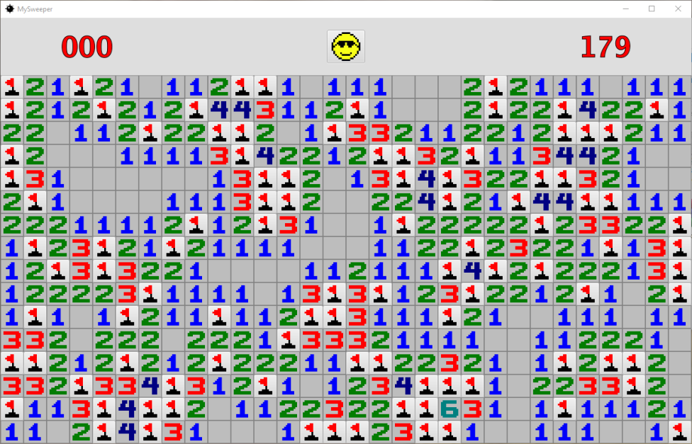

* This program was written entirely in Java utilizing their JavaFX libraries.
* The goal of this program was to allow me to become more familiar with JavaFX while creating a faithful clone of the classic Minesweeper game.
* I chose to recreate Minesweeper since it is one of my favorite games and I understood all of the mechanics.
* Through this project, I learned how to use various JavaFX layouts and got to practice making a program with a graphical interface while creating something fun!

