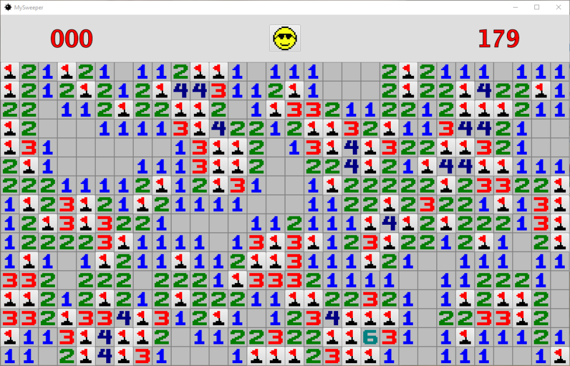

# MySweeper

Browser-based Minesweeper. Java owns game rules and REST API; React + TypeScript renders board.

## Requirements

- JDK 17+
- Maven 3.9+
- Node.js 20+

## Run locally

Open two PowerShell windows from project root.

**Terminal 1 — Java API**

```powershell
mvn spring-boot:run
```

Wait for `Started MySweeperApplication`, then leave this terminal running.

**Terminal 2 — browser client**

```powershell
cd frontend
npm install
npm run dev
```

Open `http://localhost:5173` (or URL printed by Vite). Vite forwards `/api` calls to Java server at `http://localhost:8080`.

Press `Ctrl+C` in each terminal to stop servers.

## Test and build

```powershell
mvn test
cd frontend
npm run build
```

Game sessions stay in memory. Restarting Java server clears active games.

## Controls

- Left-click: reveal a cell
- Right-click: add or remove a flag
- Hold left and right mouse buttons on a revealed number: reveal adjacent unflagged cells when adjacent flag count matches that number


